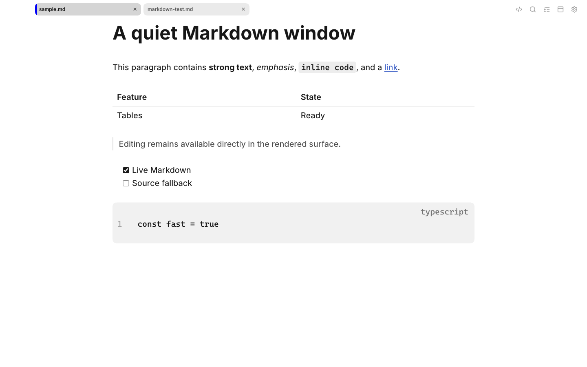
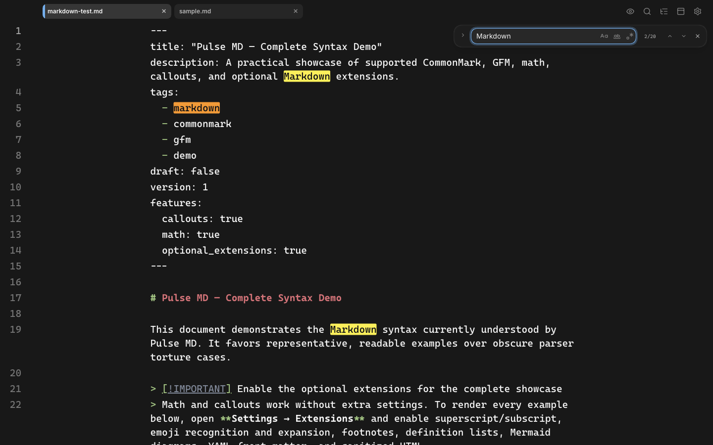
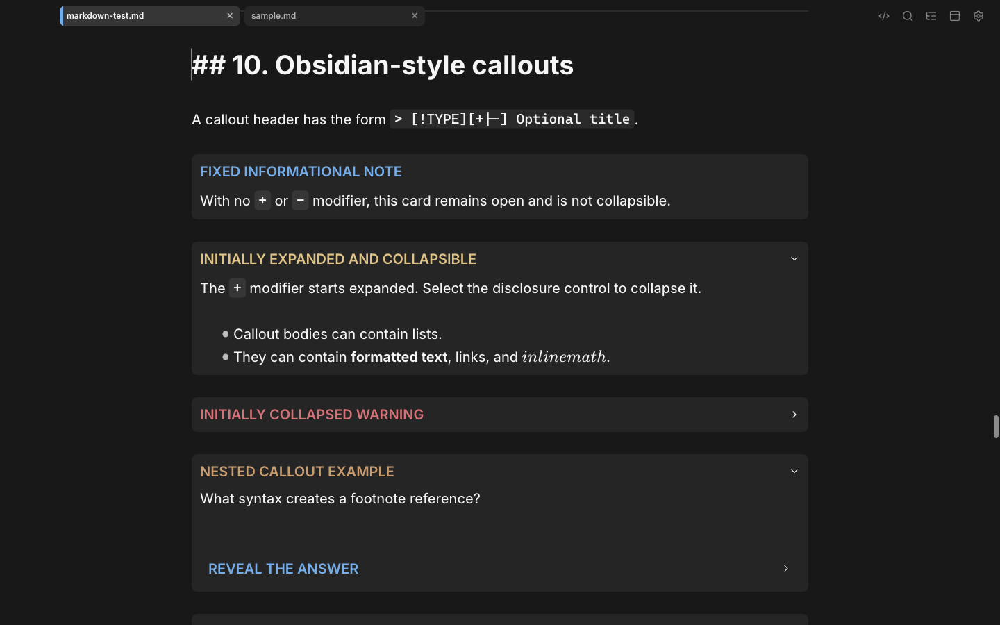
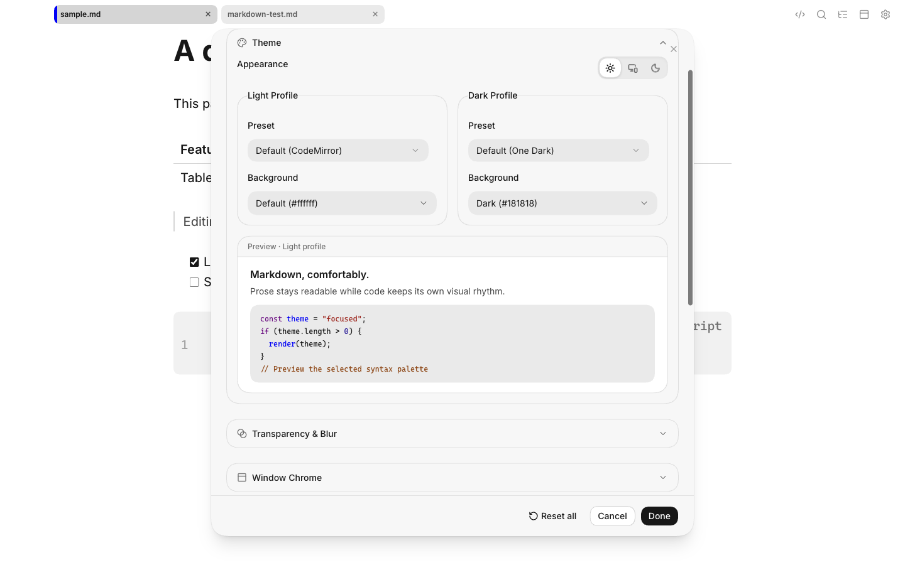

# Pulse MD

<p align="center">
  
</p>

Pulse MD is a fast, local-first desktop Markdown reader and editor. It combines
an editable live-rendered document with a deliberate Raw Markdown mode, while
keeping the surrounding interface quiet. macOS is the currently verified
platform; source packaging targets also exist for Windows and Linux.

Pulse MD 1.0 is a personal source-available project. The source is provided
as-is for noncommercial use; there is no support, maintenance, compatibility,
or release-schedule promise. Noncommercial forks and self-built copies are
welcome.



## Highlights

- **Fast from launch to first keystroke.** Startup, focus, large documents, and
  editing latency are treated as product features.
- **One surface for reading and writing.** Live mode renders Markdown in place;
  Raw Markdown mode provides a source-first editor when wanted.
- **Broad Markdown support.** CommonMark and GitHub Flavored Markdown plus
  callouts, footnotes, definition lists, emoji, math, Mermaid, YAML front
  matter, and sanitized HTML.
- **Minimal, configurable chrome.** Tabs, formatting tools, paths, and status
  information can be pinned, hidden, or shown contextually.
- **Themes and typography.** Built-in light and dark themes, custom presets,
  reading-width and zoom controls, bundled fonts, and macOS translucency.
- **Profiles and scratches.** Reusable multi-tab window profiles and standalone
  auto-saved scratch documents with stable, channel-specific app links.
- **Keyboard and CLI workflows.** Familiar shortcuts and a native `pmd` helper
  for files, standard input, tabs, profiles, scratches, cursor placement, and
  editor wait mode.

## Screenshots

| Live Markdown                                         | Raw Markdown                                          |
| ----------------------------------------------------- | ----------------------------------------------------- |
|  |  |





The screenshots are captured from the real application with the deterministic
`npm run screenshots` script.

## Build it yourself

The repository is the canonical source. To create an installable package for
the machine running the command:

```sh
git clone https://github.com/mapleroyal/pulse-md.git
cd pulse-md
npm ci
npm run package
```

Packages are written to `release/`. The command selects DMG/ZIP on macOS, NSIS
on Windows, and AppImage/DEB on Linux. It does not upload anything and does not
require storefront credentials or code-signing credentials.

Windows and Linux packages must be built and installed on their respective
operating systems before they are distributed.

Use Node.js 24 LTS when possible (Node.js 22.13 or newer is supported). Native
toolchain prerequisites and platform-specific commands are in
[Building from source](docs/BUILDING.md).

## Command line

Every packaged build uses the **Pulse MD** identity and native `pmd` helper,
whether it was built from source, downloaded directly, or eventually obtained
from a platform storefront. Keep only one packaged copy installed. Checkout
development remains isolated as **Pulse MD Development** and uses
`npm run cli:dev --`. Installation details are in the
[build guide](docs/BUILDING.md).

```sh
pmd notes.md todo.md
pmd --mouse-monitor --mode live notes.md
printf '# Quick note\n' | pmd - --stdin-name thought.md
pmd --wait .git/COMMIT_EDITMSG
pmd profile open quick-notes
pmd scratch open work-notes
```

See the complete [CLI reference](docs/CLI.md).

## Development

```sh
npm ci
npm run dev
```

The main local validation commands are:

```sh
npm run check       # formatting, lint, unit/CLI tests, build, bundle budgets
npm run check:full  # the above plus Electron end-to-end tests
```

Product, process, and performance boundaries are documented in
[AGENTS.md](AGENTS.md) and [ARCHITECTURE.md](ARCHITECTURE.md). Build and install
lanes are documented in [docs/BUILDING.md](docs/BUILDING.md). This repository
deliberately contains no GitHub build pipeline.

## Privacy and license

Pulse MD has no telemetry, account system, advertising, or automatic updater.
Documents and settings remain on the device unless the user explicitly opens
remote content or exports them.

Pulse MD source is available for noncommercial use under the
[PolyForm Noncommercial License 1.0.0](LICENSE). Third-party components and
assets retain their own licenses; see
[THIRD_PARTY_NOTICES.md](THIRD_PARTY_NOTICES.md).
