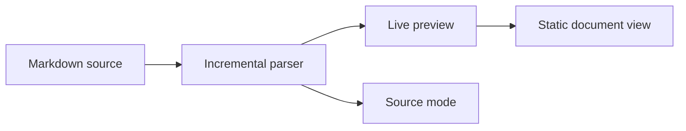
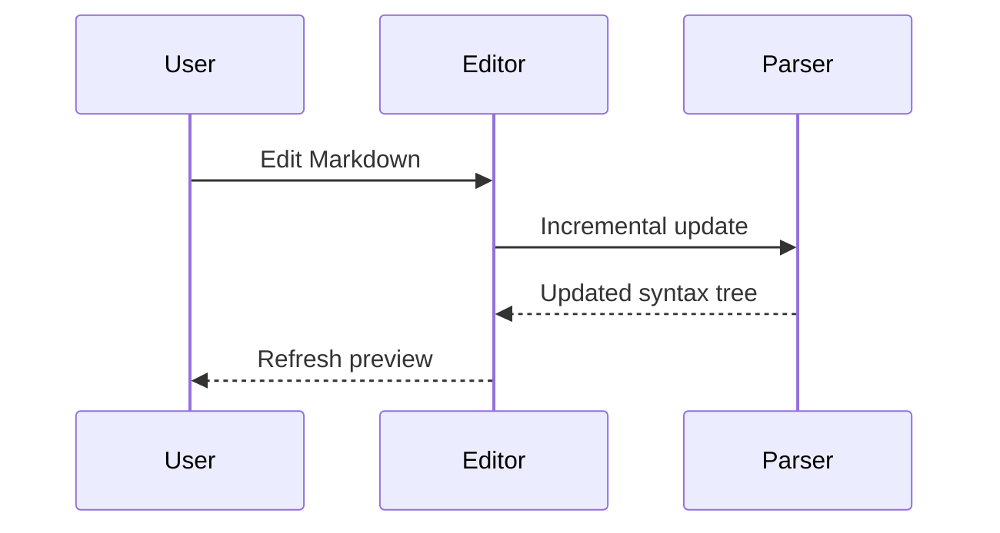

# Pulse MD — Complete Syntax Demo

This document demonstrates the Markdown syntax currently understood by Pulse MD. It favors representative, readable examples over obscure parser torture cases.

> [!IMPORTANT] Enable the optional extensions for the complete showcase
> Math and callouts work without extra settings. To render every example below, open **Settings → Extensions** and enable superscript/subscript, emoji recognition and expansion, footnotes, definition lists, Mermaid diagrams, YAML front matter, and sanitized HTML.

| Syntax family | Availability | Included here |
| --- | --- | --- |
| CommonMark | Always on | Headings, prose, emphasis, lists, quotes, code, links, images, breaks, escapes, entities, and raw HTML parsing |
| GitHub Flavored Markdown | Always on | Tables, task lists, strikethrough, and bare autolinks |
| App extensions | Always on | Alphabetic/Roman ordered lists, KaTeX math, and Obsidian-style callouts |
| Settings extensions | Off by default | YAML front matter, sup/sub, emoji, footnotes, definition lists, Mermaid, and sanitized HTML |

## Contents

1. [Headings](#1-headings)
2. [Paragraphs and line breaks](#2-paragraphs-and-line-breaks)
3. [Inline formatting](#3-inline-formatting)
4. [Thematic breaks and blockquotes](#4-thematic-breaks-and-blockquotes)
5. [Lists and tasks](#5-lists-and-tasks)
6. [GFM tables](#6-gfm-tables)
7. [Links and images](#7-links-and-images)
8. [Code spans and blocks](#8-code-spans-and-blocks)
9. [Mathematics](#9-mathematics)
10. [Obsidian-style callouts](#10-obsidian-style-callouts)
11. [Optional extensions](#11-optional-extensions)
12. [Parser-level and source-only constructs](#12-parser-level-and-source-only-constructs)
13. [Combined nesting](#13-combined-nesting)

---

## 1. Headings

The document title above is an ATX level-one heading. The remaining ATX levels follow.

## ATX level two

### ATX level three

#### ATX level four

##### ATX level five

###### ATX level six

### Optional closing hashes ###

Setext level one
================

Setext level two
----------------

Heading text may contain *emphasis*, `code`, &amp; character references.

---

## 2. Paragraphs and line breaks

This is one paragraph. A blank line ends it and begins the next paragraph.

This line is followed by an ordinary soft line break in the source.
The next source line remains part of the same paragraph.

This line ends with two spaces for a hard break.  
This line appears after that hard break.

This line ends with a backslash for another hard break.\
This line appears after the backslash break.

Multiple     spaces inside ordinary prose remain source text, while Markdown layout controls paragraph flow.

---

## 3. Inline formatting

### Emphasis and deletion

- *Italic with asterisks*
- _Italic with underscores_
- **Bold with asterisks**
- __Bold with underscores__
- ***Bold and italic***
- **Bold containing _italic_ text**
- *Italic containing **bold** text*
- ~~GFM strikethrough~~
- ~~Deleted text with **bold content** inside~~

### Inline code

Use `const answer = 42` for a short code span.

Use ``a `backtick` inside`` when the code itself contains a backtick.

An inline code span keeps Markdown-looking text literal: `**not bold** :rocket: $not_math$`.

Wrapped inline-code spacing stress test: `alpha()` `beta()` `gamma()` `delta()` `epsilon()` `zeta()` `eta()` `theta()` `iota()` `kappa()` `lambda()` `mu()` `nu()` `xi()` `omicron()` `pi()` `rho()` `sigma()` `tau()` `upsilon()` `phi()` `chi()` `psi()` `omega()`.

### Escapes and character references

Backslash escapes produce literal punctuation: \*not italic\*, \# not a heading, \[not a link\], and \`not code\`.

CommonMark character references include &amp;, &copy;, &#9731;, and &#x1F680;.

### Optional inline extensions

With superscript/subscript enabled: H~2~O, CO~2~, x^2^, and 2^10^.

With emoji recognition and expansion enabled: :rocket: :+1: :-1: :warning: :100: :unknown_demo_alias:.

Escaped and code-contained emoji tokens stay literal: \:rocket: and `:rocket:`.

---

## 4. Thematic breaks and blockquotes

Three equivalent thematic-break forms are shown between the labels below.

First form:

* * *

Second form:

_ _ _

Third form:

---

> A blockquote can contain **formatted prose**, [links](https://example.com), and `inline code`.
>
> It can contain multiple paragraphs when the blank quote line is preserved.
>
> > Nested blockquotes use additional `>` markers.
> >
> > - Lists can be nested inside quotes.
> > - So can inline math: $a^2 + b^2 = c^2$.

---

## 5. Lists and tasks

### Unordered marker forms

- Dash marker
- Another dash item

+ Plus marker
+ Another plus item

* Asterisk marker
* Another asterisk item

### Ordered marker forms and starting values

1. Period marker
2. Second item
3. Third item

1) Parenthesis marker
2) Another parenthesis item

7. This ordered list deliberately starts at seven.
8. Its next item follows.

### Alphabetic and Roman ordered markers

a. Lowercase alphabetic marker
b. Its next item

A) Uppercase alphabetic marker
B) Its next item

i. Lowercase Roman marker
ii. Its next item

I) Uppercase Roman marker
II) Its next item

1. Decimal parent
   a. Lowercase alphabetic child
   b. Its next child

### Nested and loose lists

- Parent item
  - Child item
    1. Ordered grandchild
    2. Another grandchild
  - Second child
- Second parent

- A loose-list item with a first paragraph.

  This is a second paragraph inside the same list item.

- The next loose-list item contains a quote:

  > Quoted content inside a list item.

### Marker-relative list indentation

- A bullet parent uses a two-column content indent.
  - Its child aligns with the parent's text.

1. A one-digit ordered parent uses three columns.
   - Its child remains part of the ordered item.

10. A two-digit ordered parent uses four columns.
    - Its child remains part of the ordered item.

100. A three-digit ordered parent uses five columns.
     - Its child remains part of the ordered item.

> 1. Quoted ordered parents still measure from the physical source column.
>    - Their children remain nested inside both containers.

### GFM task lists

- [x] Completed with lowercase `x`
- [X] Completed with uppercase `X`
- [ ] Still open
  - [x] Nested completed task
  - [ ] Nested open task

1. [ ] Ordered task with a period delimiter
2. [x] Completed ordered task with a period delimiter

1) [ ] Ordered task with a parenthesis delimiter
2) [x] Completed ordered task with a parenthesis delimiter

---

## 6. GFM tables

The parser accepts alignment colons. The current live table presentation uses equal-width columns rather than visually applying left/center/right alignment.

| Left | Center | Right | Markdown inside cells |
| :--- | :---: | ---: | --- |
| Alpha | Beta | Gamma | **bold**, *italic*, and `code` |
| One | Two | Three | [a link](https://example.com) |
| Escaped pipe | A \| B | C | ~~deleted~~ text |

A compact table does not require outer pipes:

Name | Value
--- | ---
Theme | System
Mode | Live preview

---

## 7. Links and images

### Inline links

- [Ordinary HTTPS link](https://example.com)
- [Link with a title](https://example.com "Example title")
- [Angle-bracket destination](<https://example.com/a path> "Destination containing a space")
- [Jump back to the document title](#pulse-md--complete-syntax-demo)
- [Empty destination returns to the document top]()

### Reference links

- [Full reference link][commonmark]
- [Collapsed reference][]
- [Shortcut reference]
- [Reference with a single-quoted title][single-title]
- [Reference with a parenthesized title][parenthesized-title]
- Unresolved syntax stays literal: [missing-reference]

[commonmark]: https://spec.commonmark.org "CommonMark specification"
[collapsed reference]: https://github.github.com/gfm/ "GFM specification"
[shortcut reference]: https://codemirror.net 'CodeMirror'
[single-title]: https://example.com/single 'Single-quoted title'
[parenthesized-title]: https://example.com/parenthesized (Parenthesized title)

### Autolinks

- CommonMark URL autolink: <https://example.com/docs>
- CommonMark email autolink: <demo@example.com>
- GFM bare URL: https://example.com/bare
- GFM `www` URL: www.example.com/path
- GFM bare email: demo@example.com
- Explicit email protocol: mailto:demo@example.com
- XMPP protocol: xmpp:demo@example.com

### Images

This self-contained image uses a data URI:


Reference-style image syntax:

![A tiny reference image][demo-image]

A linked image combines image and link syntax:

[![Linked demo image][demo-image]](https://commonmark.org "Open CommonMark")

[demo-image]: <data:image/svg+xml,%3Csvg%20xmlns=%22http://www.w3.org/2000/svg%22%20width=%22160%22%20height=%2260%22%3E%3Crect%20width=%22160%22%20height=%2260%22%20rx=%228%22%20fill=%22%230f766e%22/%3E%3Ctext%20x=%2280%22%20y=%2237%22%20text-anchor=%22middle%22%20font-family=%22sans-serif%22%20font-size=%2216%22%20fill=%22white%22%3EReference%20image%3C/text%3E%3C/svg%3E> "Reference data image"

---

## 8. Code spans and blocks

### Indented code block

    This is a CommonMark indented code block.
    It uses the standard code card, line numbers, copy action, and wrap control without a language label or syntax coloring.

### Backtick fence with a language

```javascript
const syntaxFamilies = ["CommonMark", "GFM", "Math", "Callouts"];

function describe(enabled) {
  return enabled ? `Enabled: ${syntaxFamilies.join(", ")}` : "Disabled";
}

console.log(describe(true));
```

### Tilde fence

~~~python
from dataclasses import dataclass

@dataclass
class Demo:
    name: str
    complete: bool = True

print(Demo(name="Markdown"))
~~~

### A longer fence containing a shorter fence

````markdown
```typescript
const nested: boolean = true;
```
````

### Representative CodeMirror language modes

The first code-fence info token selects from CodeMirror’s language registry. The app currently ships 143 language descriptions; the blocks below sample major language families rather than duplicating every programming grammar.

```typescript
interface Feature {
  name: string;
  optional: boolean;
}

const feature: Feature = { name: "footnotes", optional: true };
```

```json
{
  "renderer": "Pulse MD",
  "extensions": ["footnotes", "mermaid", "yaml"]
}
```

```bash
for file in *.md; do
  printf 'Markdown file: %s\n' "$file"
done
```

```sql
SELECT syntax, enabled
FROM markdown_features
WHERE family IN ('CommonMark', 'GFM');
```

```diff
- old behavior
+ new behavior
```

```unknown-language
Unknown info strings still produce an ordinary fenced code block.
They simply do not receive a nested language grammar.
```

> [!INFO]+ Commonly useful fence aliases
> Examples include `c`, `cpp`, `csharp`, `go`, `java`, `kotlin`, `rust`, `swift`, `js`, `jsx`, `ts`, `tsx`, `python`, `ruby`, `php`, `bash`, `sh`, `zsh`, `powershell`, `json`, `yaml`, `toml`, `html`, `css`, `scss`, `sql`, `xml`, `markdown`, `latex`, `diff`, and `dockerfile`.

---

## 9. Mathematics

Math is always parsed and rendered with KaTeX when the expression is complete.

Inline dollar delimiters: $a^2 + b^2 = c^2$ and $E = mc^2$.

Inline parenthesized delimiters: \(e^{i\pi} + 1 = 0\).

A same-line display expression:

$$\sum_{k=1}^{n} k = \frac{n(n+1)}{2}$$

A multiline dollar display:

$$
\int_a^b f(x)\,dx
= F(b) - F(a)
$$

A bracket-delimited display:

\[
\begin{aligned}
f(x) &= (x + 1)^2 \\
     &= x^2 + 2x + 1
\end{aligned}
\]

> Quoted math works too: $\alpha + \beta = \gamma$.

---

## 10. Obsidian-style callouts

A callout header has the form `> [!TYPE][+|-] Optional title`.

> [!NOTE] Fixed informational note
> With no `+` or `-` modifier, this card remains open and is not collapsible.

> [!TIP]+ Initially expanded and collapsible
> The `+` modifier starts expanded. Select the disclosure control to collapse it.
>
> - Callout bodies can contain lists.
> - They can contain **formatted text**, links, and $inline math$.

> [!WARNING]- Initially collapsed warning
> The `-` modifier starts collapsed. Expand it to reveal this body.
>
> The body can contain multiple paragraphs.

> [!QUESTION]+ Nested callout example
> What syntax creates a footnote reference?
>
> > [!ANSWER]- Reveal the answer
> > Use a label prefixed by a caret: `[^label]`.
> >
> > > [!DEEPER]- Deeper nesting
> > > Nested callouts can continue to additional blockquote depths.

> [!custom-type] Custom authored title
> Arbitrary whitespace-free types are accepted and use the general information treatment.

> [!TLDR] Alias example
> Callout types are case-insensitive. Common aliases include `note`, `summary`, `tldr`, `hint`, `check`, `done`, `faq`, `help`, `attention`, `error`, `caution`, `fail`, `missing`, and `cite`.

> [!EXAMPLE]+ Fenced code inside a callout
> ```json
> {
>   "nested": true,
>   "location": "callout"
> }
> ```

---

## 11. Optional extensions

Everything in this section requires its corresponding **Settings → Extensions** toggle.

### YAML front matter

The YAML metadata block at the absolute beginning of this file is the active example. It demonstrates strings, numbers, booleans, sequences, and nested mappings. A YAML block can close with either `---` or `...`, but only a block at the very start of the document is recognized as front matter.

```yaml
---
title: Alternate YAML example
published: true
tags:
  - one
  - two
...
```

The fenced block above is illustrative source; it is not a second active front-matter block.

### Pandoc-style superscript and subscript

- Water: H~2~O
- Carbon dioxide: CO~2~
- Square: x^2^
- Large exponent: 2^10^
- Escaped markers remain literal: \~not subscript\~ and \^not superscript\^

### Emoji shortcode recognition and expansion

Known aliases: :rocket: :sparkles: :warning: :+1: :-1: :100:.

An unknown but well-formed token remains literal: :definitely_not_a_real_demo_emoji:.

Recognition accepts letters, digits, plus, minus, and underscores. Tokens containing spaces or dots are not recognized: `:two words:` and `:dot.name:`.

### Footnotes

This sentence cites a rich footnote[^rich-note]. A second citation appears here[^second-note], and the first footnote can be cited again[^rich-note].

An unresolved reference remains literal: [^missing-note].

### Definition lists

CommonMark
: A strongly specified Markdown dialect used as the app’s parsing baseline.

GFM
: GitHub Flavored Markdown adds tables, task lists, strikethrough, and bare autolinks.
~ A second definition can use a tilde marker.

Live preview

: A source-preserving presentation that hides inactive markup while keeping the document editable.

    A definition may contain a second indented paragraph.

    - It may also contain nested block content.
    - This nested list is part of the same definition.

### Mermaid diagrams

Mermaid fences render as static, sanitized SVG. Interactive directives, external resources, user CSS, images, and configuration directives are intentionally refused.





### Sanitized HTML

Inline safe HTML includes <mark>highlighting</mark>, <kbd>⌘K</kbd>, <u>underlining</u>, <small>small text</small>, H<sub>2</sub>O, x<sup>2</sup>, and an explicit<br>line break.

All attributes are stripped from the rendered preview, including the harmless attributes in this example:

<div class="demo-card" data-demo="ignored">
  <h3>Sanitized HTML block</h3>
  <p><strong>Static formatting survives.</strong> Scripts, event handlers, links, images, forms, media, SVG, and other active content are not allowed.</p>
  <ul>
    <li><em>Emphasis</em> remains.</li>
    <li><code>Code text</code> remains.</li>
    <li><mark>Marked text</mark> remains.</li>
  </ul>
</div>

---

## 12. Parser-level and source-only constructs

Some CommonMark forms parse correctly but intentionally do not receive a bespoke rendered widget.

### HTML comment

<!-- This CommonMark HTML comment is parser-supported and intentionally remains source-only. -->

### HTML declaration

<!DOCTYPE html>

### Processing instruction

<?markdown-demo?>

### Source-oriented examples

- Hard-break markers parse, but their spaces or backslash do not get a special widget.
- Backslash escapes and character references receive parser highlighting rather than a custom replacement.
- Indented code uses the standard code card and controls, but intentionally has no language label or syntax coloring.
- Raw HTML outside the conservative sanitized allowlist remains literal source.

> [!NOTE] Deliberate boundaries
> Obsidian wikilinks (`[[note]]`), embeds (`![[image]]`), `==highlight==`, tags and block IDs, attribute lists, fenced divs, and `<details>/<summary>` HTML collapsibles are not special syntax in this app. Collapsibility is provided by callouts with `+` or `-` modifiers.

---

## 13. Combined nesting

1. An ordered item can contain a task list.
   - [x] Completed nested task
   - [ ] Open nested task with **bold text** and `code`
2. It can contain a blockquote.

   > [!SUCCESS]+ Combined feature card
   > This callout is nested inside an ordered list.
   >
   > | Feature | Result |
   > | --- | --- |
   > | Table | Parsed |
   > | Math | $2^5 = 32$ |
   >
   > ```typescript
   > const combined = true;
   > ```

3. It can finish with an ordinary paragraph and a footnote reference[^combined-note].

---

## End of demo

If every optional extension is enabled, this file exercises the app’s mainstream CommonMark and GFM surface, always-on math and callouts, all current Settings extensions, and representative fenced-code language highlighting.

[^rich-note]: Footnote definitions can contain **formatted inline Markdown**.

    They can continue with a second paragraph when indented by four spaces.

    - Rich definitions can contain nested lists.
    - Labels are matched case-insensitively.

[^second-note]: Footnotes are numbered by their first resolved reference in the document.

[^combined-note]: This footnote is referenced from the combined-nesting section.
