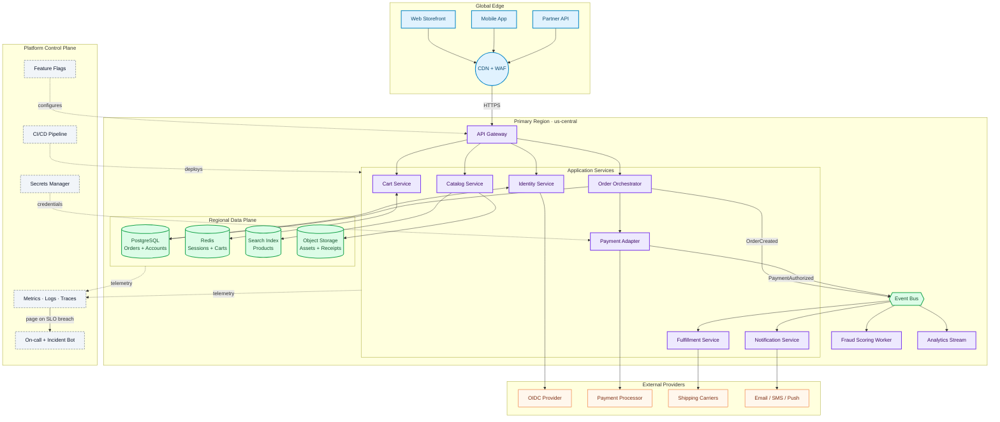
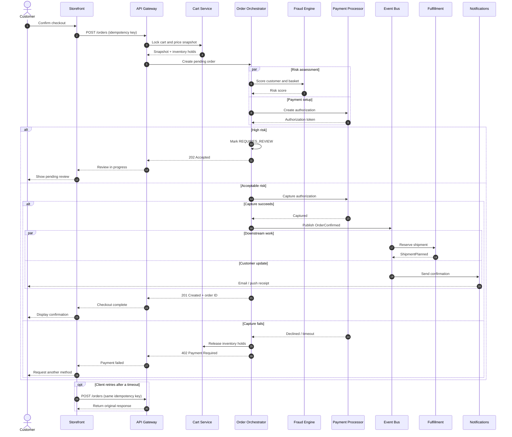
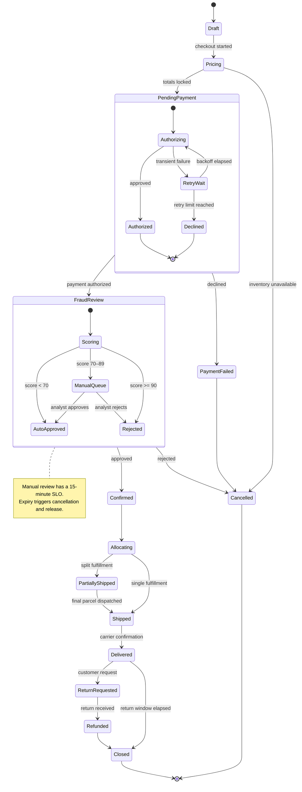

# Complex Mermaid Demo: Atlas Commerce Platform

This fixture preserves the first three diagrams and their original sizes from the
reported complex Mermaid document.

## 1. System architecture

## 2. Checkout orchestration sequence

## 3. Order lifecycle state machine

## Content after diagrams

The renderer remains interactive below all three replacements.
